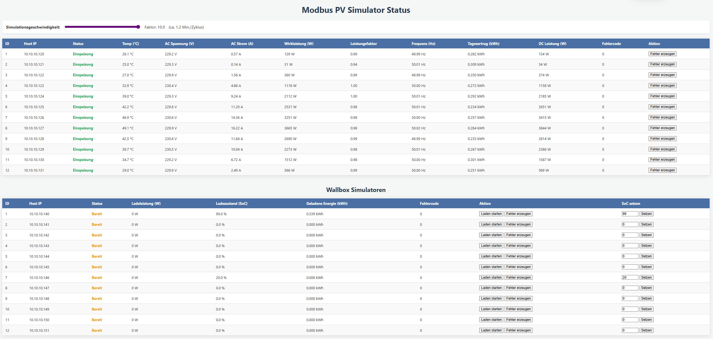

# PV and Wallbox Simulator with Modbus TCP

This script simulates multiple photovoltaic (PV) inverters, each with its own Modbus TCP server instance. It's designed as a data source for home automation systems like IP-Symcon or for testing Modbus client implementations that need to interact with multiple devices.

A specific German-language guide for setup is available here: [Anleitung.md](Anleitung.md) and here [Dozent.md](Dozent.md)
A handout file is stored here: [handout.md](handout.md)

## Features

*   **Multiple Modbus Servers**: Simulates 12 independent PV inverters and **12 Wallboxes**, each on its own IP address.
*   **Realistic Data**: Generates dynamic data for a daily solar cycle (PV) and simulates interactive EV charging sessions (Wallbox).
*   **Web Monitoring UI**: A built-in Flask web server provides a dashboard to monitor and control all simulated devices in real-time.
*   **Configurable**: Easily change IP addresses, port, and update speed in the `main.py` script.



## Configuration

Key options at the top of `main.py`:

*   `PV_HOST_IPS`: (Default: `10.10.10.120` to `10.10.10.131`) A list of IP addresses for the PV inverters.
*   `WALLBOX_HOST_IPS`: (Default: `10.10.10.140` to `10.10.10.151`) A list of IP addresses for the Wallboxes.
*   `TCP_PORT`: (Default: `5020`) The TCP port for all Modbus server instances.
*   `UI_HOST`: (Default: `0.0.0.0`) The host address for the web monitoring UI.
*   `UI_PORT`: (Default: `5010`) The port for the web monitoring UI.

## Modbus Registers

The simulator provides two types of devices: PV Inverters and Wallboxes. It uses Modbus Holding Registers (read with Function Code 3), and all addresses are 1-indexed.

### PV Inverter Registers (per instance)
The simulator provides a comprehensive set of registers for a detailed PV inverter simulation.

| Address | Name | Data Type | Client Factor | Unit | Description |
|---|---|---|---|---|---|
| 1 | AC Voltage | `INT16` | `0.1` | V | AC Line-to-Neutral Voltage |
| 2 | AC Current | `INT16` | `0.01` | A | AC Output Current |
| 3 | Apparent Power | `INT16` | `1` | VA | Apparent Power (S = U * I) |
| 4 | Active Power | `INT16` | `1` | W | Real Power (P) |
| 5 | Power Factor | `INT16` | `0.01` | - | Power Factor (cos φ) |
| 6 | Reactive Power | `INT16` | `1` | VAR | Reactive Power (Q) |
| 7 | Frequency | `INT16` | `0.01` | Hz | Grid Frequency |
| 8-9 | Daily Yield | `UINT32` | `1` | Wh | Accumulated energy for the day |
| 10-11 | Total Yield | `UINT32` | `1` | kWh | Total accumulated energy |
| 12 | Operating State | `INT16` | `1` | - | `1`:Standby, `2`:Feeding, `3`:Fault |
| 13 | Device Temperature | `INT16` | `0.1` | °C | Internal inverter temperature |
| 14 | Fault Code | `INT16` | `1` | - | Active fault code (0 = OK) |
| 15 | DC Voltage | `INT16` | `0.1` | V | DC Input Voltage |
| 16 | DC Current | `INT16` | `0.01` | A | DC Input Current |
| 17 | DC Power | `INT16` | `1` | W | DC Input Power (P_DC) |

**Note on 32-bit Registers:** `Daily Yield` and `Total Yield` are 32-bit unsigned integers (`UINT32`) that span two 16-bit Modbus registers. When reading, you must query both registers (e.g., starting at address 8 for a length of 2). The server stores values in **High Word First** order.

### Wallbox Registers (per instance)

| Address | Name | Data Type | Client Factor | Unit | Description |
|---|---|---|---|---|---|
| 20 | Wallbox State | `INT16` | `1` | - | `1`:Ready, `2`:Charging, `3`:Fault |
| 21 | Charging Power | `INT16` | `1` | W | Current charging power |
| 22 | State of Charge | `INT16` | `1` | % | SoC of the connected vehicle |
| 23-24 | Charged Energy | `UINT32` | `1` | Wh | Energy transferred in this session |
| 25 | Wallbox Fault Code | `INT16` | `1` | - | Active fault code (0=OK, 201=...) |
| 26 | Remote Control | `INT16` | `1` | - | Write `1` to start, `2` to stop |

---

## Running the Simulator

### 1. Network Configuration (Required)

For the script to work, the host machine must be assigned the IP addresses used by the simulators. Both the machine running the script and the client (e.g., IP-Symcon) must be in the same subnet to communicate.

Here is an example configuration for **Ubuntu/Debian using `netplan`**.

1.  **Identify your network interface name** (e.g., `eth0`, `ens18`) using `ip addr`.

2.  **Create or edit a netplan config file** in `/etc/netplan/`, for example `01-custom-ips.yaml`.

3.  **Add the required IP addresses.** The following configuration sets a static primary IP (`10.10.10.115`) and adds all the simulator IPs. **Replace `ens18` with your interface name.**

    ```yaml
    # /etc/netplan/01-custom-ips.yaml
    network:
      version: 2
      renderer: networkd
      ethernets:
        ens18: # <-- IMPORTANT: Replace with your network interface name
          dhcp4: no
          addresses:
            - 10.10.10.115/24   # Primary IP for the server
            - 10.10.10.120/24   # First simulator IP
            - 10.10.10.121/24
            - 10.10.10.122/24
            - 10.10.10.123/24
            - 10.10.10.124/24
            - 10.10.10.125/24
            - 10.10.10.126/24
            - 10.10.10.127/24
            - 10.10.10.128/24
            - 10.10.10.129/24
            - 10.10.10.130/24
            - 10.10.10.131/24
            # Wallbox IPs
            - 10.10.10.140/24
            - 10.10.10.141/24
            - 10.10.10.142/24
            - 10.10.10.143/24
            - 10.10.10.144/24
            - 10.10.10.145/24
            - 10.10.10.146/24
            - 10.10.10.147/24
            - 10.10.10.148/24
            - 10.10.10.149/24
            - 10.10.10.150/24
            - 10.10.10.151/24
          routes:
            - to: default
              via: 10.10.10.1
          nameservers:
            addresses: [10.10.10.1]
    ```

4.  **Apply the new network configuration:**
    ```bash
    sudo netplan apply
    ```
    Verify the IPs are assigned with `ip addr show dev ens18`.

### 2. Install Dependencies

The script requires `pymodbus` for the Modbus servers and `flask` for the web UI.
```bash
pip install -r requirements.txt
```

### 3. Launch the Script

Run the script from your terminal:
```bash
python3 main.py
```
The script will confirm the launch of all 12 Modbus servers and the web UI. Press `Ctrl+C` to stop.

## Web Monitoring UI

Once running, you can view the status of all simulators via the web dashboard.
*   **URL**: `http://<your-server-ip>:5010`
*   Example: `http://10.10.10.115:5010`

The dashboard shows each inverter's IP, status, and real-time data for key metrics like AC power, daily yield, and DC power.

## Connecting a Modbus Client (e.g., IP-Symcon)

For detailed instructions on how to connect a Modbus client and configure it to read the available registers, please refer to the user manual: **[Anleitung.md](Anleitung.md)**.
